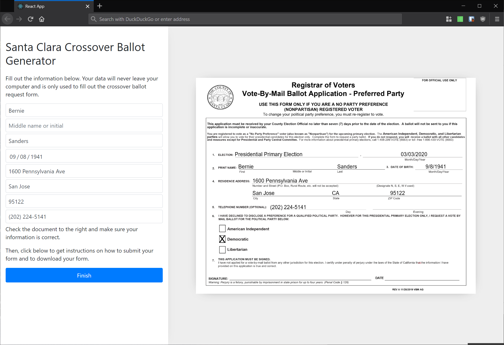

# Santa Clara County NPP Crossover Form Filler

## Background

If a voter registered in California and declared "No Party Preference", they must request a crossover ballot in order to vote in the Democratic primary. To receive this crossover ballot by mail, the Santa Clara County Registrar of Voters [requires voters to fill out a PDF form](https://www.sccgov.org/sites/rov/VBM/Pages/vbmFAQ.aspx), physically sign it with ink, and submit the form via email, postal mail, fax, or hand delivery. Some of these fields aren't obvious, which makes filling out the form harder than it should be.

This is a quick prototype to automate filling out this PDF form.

## Contributing

PRs welcome. This project uses `create-react-app` with TypeScript, so use `yarn` to install dependencies, `yarn start` for the dev server, and `yarn build` to create a production build.
